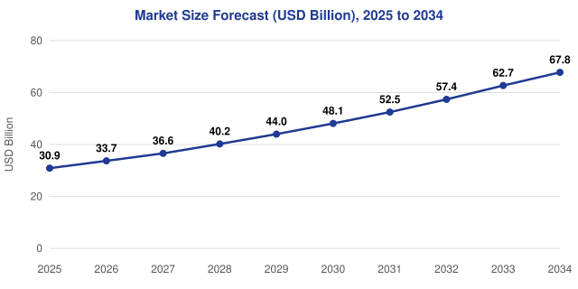
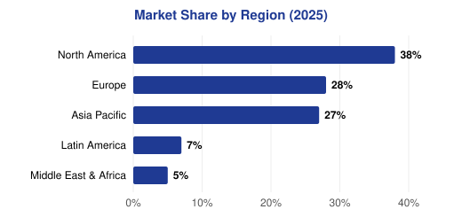
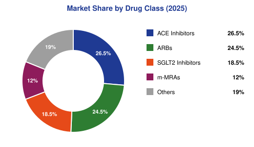
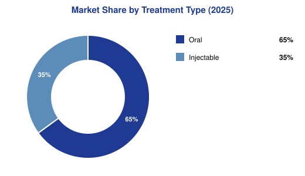
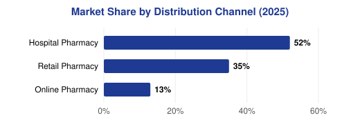
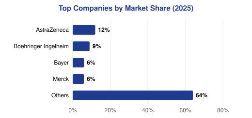
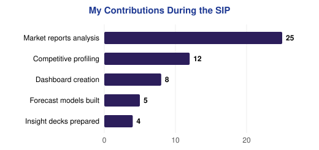

# Global Chronic Kidney Disease (CKD) Market Intelligence

Interactive Power BI dashboard and market-sizing study built during my Summer Internship Program (SIP) at **BrandEssence Market Research & Consulting Pvt. Ltd.**

| | |
|---|---|
| **Prepared by** | Bhumika Thakur, MBA-HA02, Roll no. 0046, IIHMR University |
| **Faculty mentor** | Dr. Ritu Vashishtha |
| **Organization mentor** | Onkar Kanade |
| **Tools** | Power BI Desktop, Microsoft Excel |
| **Forecast window** | 2025 to 2034 |


---

## 1. What this project is

BrandEssence needed a single view of the global CKD therapeutics market: how big it is, how fast it is growing, which drugs, regions, channels and companies matter, and where the commercial opportunity sits. I built the market model in Excel, then turned it into an interactive Power BI dashboard so the research and strategy team could slice the numbers instead of reading them off a static report.

## 2. Objectives

1. Estimate the global CKD market size for 2025 to 2034.
2. Analyze historical and forecast market growth using CAGR.
3. Identify major therapy segments and their growth potential.
4. Evaluate regional market distribution and the competitive landscape.
5. Develop an interactive Power BI dashboard for market intelligence and business decision-making.

## 3. Headline results

| Metric | Value |
|---|---|
| Estimated market size (2025) | USD 30.9 Bn |
| Forecast market size (2034) | USD 67.8 Bn |
| CAGR (2026 to 2034) | 9.2% |
| Largest regional market | North America (38%) |
| Fastest-growing region | Asia Pacific |
| Leading drug class | ACE Inhibitors (26.5%) |
| Fastest-growing drug class | SGLT2 Inhibitors |
| Major market driver | Rising CKD prevalence, aging population, innovation in therapies |
| Key business opportunity | High unmet need, expansion in emerging markets, early diagnosis and better treatment adherence |

## 4. Dashboard pages and visuals

The Power BI report is organised around six charts, exported below.

**Market Size Forecast (USD Bn), 2025 to 2034** (line chart)



| Year | USD Bn |
|---|---|
| 2025 | 30.9 |
| 2026 | 33.7 |
| 2027 | 36.6 |
| 2028 | 40.2 |
| 2029 | 44.0 |
| 2030 | 48.1 |
| 2031 | 52.5 |
| 2032 | 57.4 |
| 2033 | 62.7 |
| 2034 | 67.8 |

<table><tr>
<td></td>
<td></td>
</tr><tr>
<td></td>
<td></td>
</tr><tr>
<td colspan="2"></td>
</tr></table>

**Market Share by Region (2025)** (bar chart): North America 38%, Europe 28%, Asia Pacific 27%, Latin America 7%, Middle East & Africa 5%.

**Market Share by Drug Class (2025)** (donut chart): ACE Inhibitors 26.5%, ARBs 24.5%, SGLT2 Inhibitors 18.5%, m-MRAs 12.0%, Others 19.0%.

**Market Share by Treatment Type (2025)** (donut chart): Oral 65%, Injectable 35%.

**Market Share by Distribution Channel (2025)** (bar chart): Hospital Pharmacy 52%, Retail Pharmacy 35%, Online Pharmacy 13%.

**Top 5 Companies by Market Share (2025)** (bar chart): AstraZeneca 12%, Boehringer Ingelheim 9%, Bayer 6%, Merck 6%, Others 64%.

## 5. Methodology

1. **Secondary research.** Reviewed industry reports, journals, company annual reports and public databases.
2. **WHO / GBD / KDIGO data collection.** Collected epidemiology and prevalence data from WHO, the Global Burden of Disease study and KDIGO guidelines.
3. **Company annual reports and SEC filings.** Gathered financials, product portfolios and pipeline information for key players.
4. **Data cleaning and validation (Excel).** Standardized, cleaned and validated data for accuracy and consistency.
5. **Market sizing and data triangulation.** Top-down and bottom-up approaches, triangulated to produce final market estimates.
6. **Segmentation and forecast analysis.** Segmented by drug class, treatment type, distribution channel and region; forecast 2026 to 2034 using CAGR.
7. **Power BI dashboard development.** Built an interactive dashboard for KPIs, trends, segmentation and competitive intelligence.
8. **Result validation and market intelligence.** Validated results against multiple sources and translated them into actionable insights.

## 6. Data sources

World Health Organization (WHO); Global Burden of Disease (GBD); KDIGO Guidelines; company annual reports; SEC filings; BrandEssence Market Research Database; peer-reviewed journals and publications; government publications.

## 7. SWOT analysis

| Strengths | Weaknesses | Opportunities | Threats |
|---|---|---|---|
| Strong clinical adoption of established therapies | Late diagnosis and low awareness in many regions | Rising CKD prevalence and aging population | Patent expiries and biosimilar drugs |
| Robust pipeline across key companies | High treatment cost | High growth potential in emerging markets | Pricing pressure and reimbursement challenges |
| Growing awareness and early diagnosis | Limited access and dependence on chronic therapy adherence | Expansion of SGLT2 inhibitors and novel therapies | Regulatory changes and market access hurdles |

## 8. Challenges

Incomplete or inconsistent market data across sources; wide variation in market-size estimates between reports; limited access to paid databases and primary data; reconciling epidemiology data with revenue data; time constraints for deep country-level analysis.

## 9. My contributions during the SIP



| Activity | Count |
|---|---|
| Market reports analysed | 25 |
| Competitive profiles built | 12 |
| Dashboards created | 8 |
| Forecast models built | 5 |
| Insight decks prepared | 4 |

## 10. Key learnings

Improved market-sizing accuracy by triangulating 25+ reports. Built forecasting models and market estimates in Excel. Developed interactive Power BI dashboards for market intelligence. Identified high-growth therapy segments and key market drivers. Strengthened secondary research, data validation and analytical skills.

## 11. Suggestions

Expand CKD screening in low- and middle-income countries. Promote clinically appropriate adoption of SGLT2 inhibitors. Develop centralized CKD epidemiology databases for better tracking and planning. Standardize market intelligence dashboards across functions. Integrate market intelligence insights into strategic decision-making and brand planning.

## 12. Conclusion, objective by objective

**Market size estimation.** The global CKD market is estimated at USD 30.9 Bn in 2025 and projected to reach USD 67.8 Bn by 2034.

**Growth forecast (CAGR).** The market is expected to grow at a CAGR of 9.2% during 2026 to 2034, a strong upward trend.

**Therapy segments.** ACE inhibitors lead the market (26.5%), while SGLT2 inhibitors are the fastest-growing drug class with high future potential.

**Regional distribution.** North America holds the largest share (38%), followed by Europe (28%) and Asia Pacific (27%), with Asia Pacific expected to grow fastest.

**Market drivers and landscape.** Rising CKD prevalence, aging population and innovation in therapies are the key drivers shaping the competitive landscape.

**Dashboard development.** An interactive Power BI dashboard was developed to track KPIs, market sizing, segmentation, forecasts and competitor analysis.

**Business opportunity.** High unmet need, early-diagnosis adoption and expansion in emerging markets present significant growth opportunities.

**Overall impact.** The project delivered comprehensive insights into the global CKD market and strengthened my skills in research, analytics and dashboard development.

## 13. About the organisation

BrandEssence Market Research & Consulting Pvt. Ltd. is a knowledge-driven market research and consulting firm. It delivers market intelligence, competitive analysis and brand strategy for pharma, devices and healthcare organizations, combines primary and secondary research with rigorous analytics, and serves clients across global and emerging markets.

Mission: to deliver accurate, actionable market intelligence that empowers healthcare clients to make confident, evidence-based strategic and brand decisions.

Vision: to be a leading and trusted partner in healthcare market research, known for insight quality, analytical excellence and client impact.

Organisation structure: Managing Director / CEO; VP, Research & Strategy; GM, Market Intelligence; Senior Manager, Research; Project Manager; Research Analyst; Management Trainee.

## 14. Repository layout

```
.
├── README.md
├── assets/
│   ├── poster.png                    # project poster
│   ├── Poster_Enhanced.pdf
│   └── charts/                       # chart exports (SVG)
├── data/                             # model outputs used by the dashboard
│   ├── market_size_forecast.csv
│   ├── market_share_by_region.csv
│   ├── market_share_by_drug_class.csv
│   ├── market_share_by_treatment_type.csv
│   ├── market_share_by_distribution_channel.csv
│   ├── top_companies_market_share.csv
│   ├── key_metrics.csv
│   ├── swot_analysis.csv
│   └── sip_contributions.csv
├── powerbi/
│   ├── measures.dax                  # DAX measures used in the report
│   ├── data_model.md                 # tables, relationships, visual mapping
│   ├── theme.json                    # report theme
│   └── SETUP_GUIDE.md                # opening and refreshing the report in Power BI Desktop
└── docs/
    └── project_summary.md            # full project write-up
```

The `.pbix` report file belongs to BrandEssence and is shared on request. The `data/` and `powerbi/` folders hold the model outputs, DAX measures, theme and setup notes for the report; see `powerbi/SETUP_GUIDE.md`.
